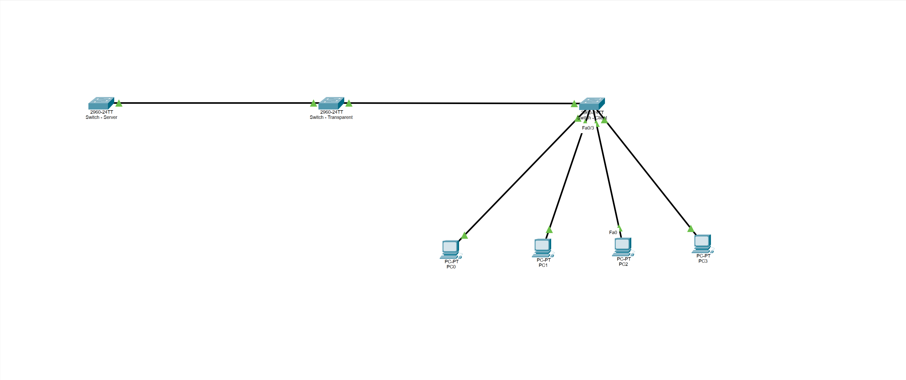
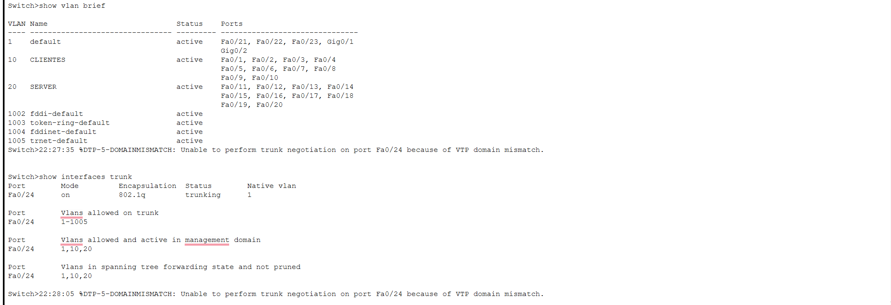
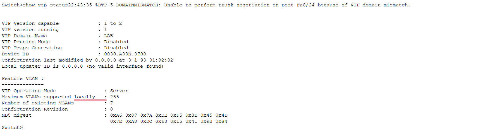
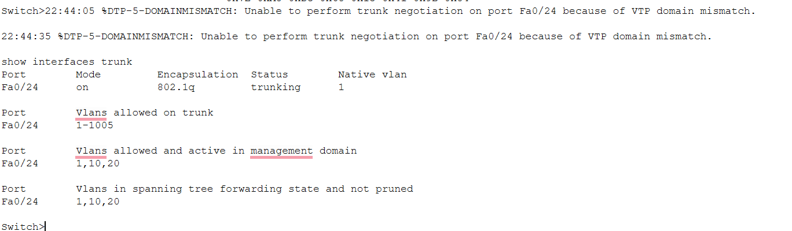
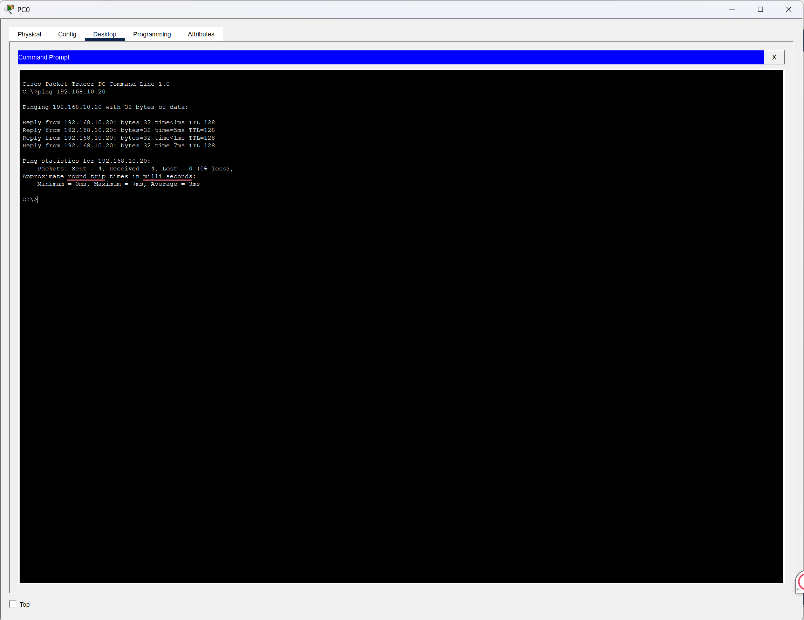
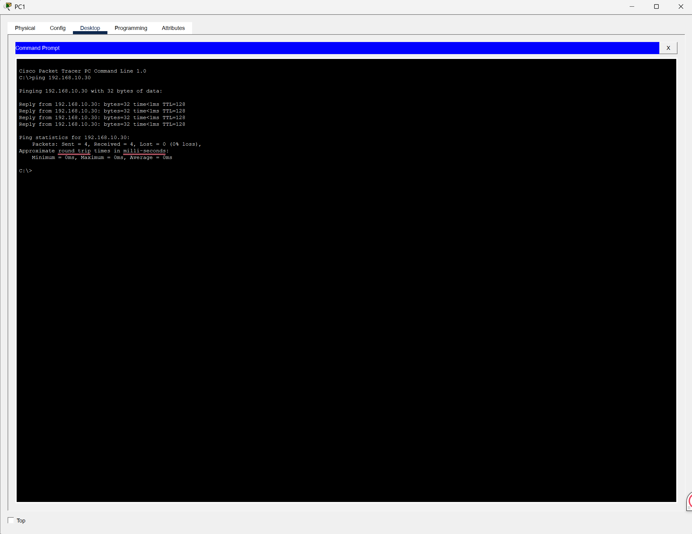
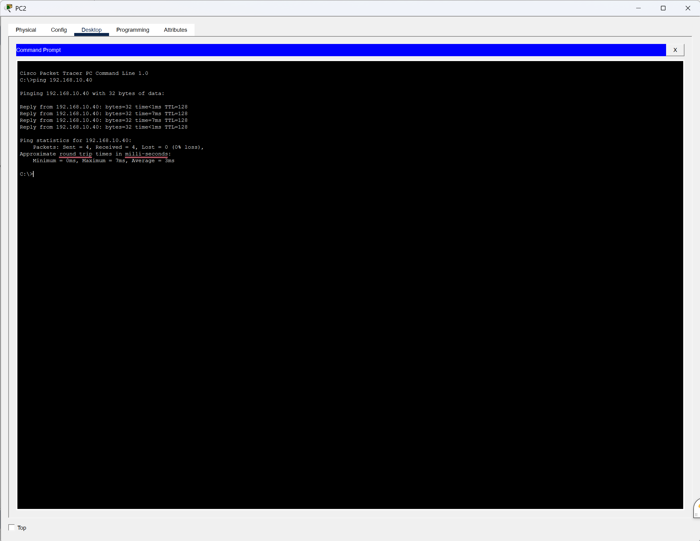
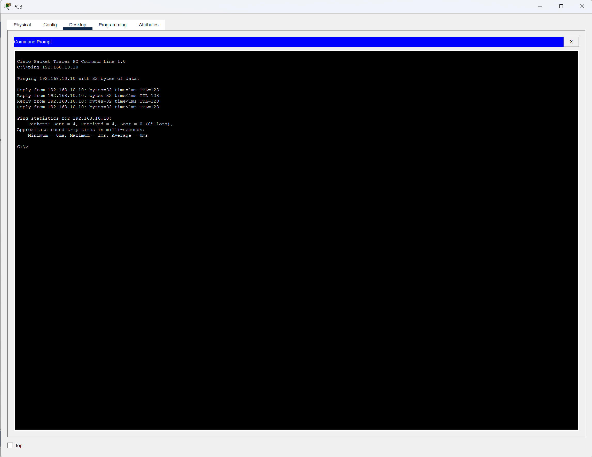

# VLAN and VTP Network Segmentation Lab

## Overview

This project demonstrates the implementation of VLANs, VTP, and trunk links using Cisco Packet Tracer to improve network segmentation, security, and management.

The lab consists of three Cisco switches configured in different VTP modes:

- VTP Server
- VTP Transparent
- VTP Client

The network was designed to simulate a small enterprise environment where devices are separated into different VLANs to reduce broadcast traffic and improve security.

---

## Objectives

- Configure VLANs on Cisco switches
- Implement VTP Server, Client, and Transparent modes
- Configure trunk links between switches
- Verify VLAN propagation across the network
- Test connectivity between devices
- Understand network segmentation and security concepts

---

## Network Topology



The topology includes:

- 3 Cisco switches
- Multiple PCs
- VLAN segmentation
- Trunk links between switches

---

## VLAN Configuration

### VLAN 10
Assigned to ports:

- Fa0/1 – Fa0/10

### VLAN 20
Assigned to ports:

- Fa0/11 – Fa0/20

### Verification



Command used:

```bash
show vlan brief
```

---

## VTP Configuration

### VTP Server

Responsible for creating and managing VLANs.



### VTP Transparent

Forwards VTP advertisements while maintaining its own VLAN database.

### VTP Client

Receives VLAN information from the VTP Server.

---

## Trunk Configuration

Trunk ports were configured between switches to allow VLAN traffic to traverse the network.



Command used:

```bash
show interfaces trunk
```

---

## Connectivity Testing

The following tests were performed to verify communication within VLANs:

### Ping Test 1



### Ping Test 2



### Ping Test 3



### Ping Test 4



---

## Technologies Used

- Cisco Packet Tracer
- Cisco IOS
- VLANs
- VTP
- Trunking
- Layer 2 Switching
- Network Segmentation

---

## Security Impact

This lab demonstrates how VLAN segmentation can improve network security by isolating groups of devices and reducing unnecessary broadcast traffic.

Benefits include:

- Improved security
- Better traffic management
- Reduced attack surface
- Easier network administration
- Logical separation of users and resources

---

## Skills Demonstrated

- VLAN Configuration
- VTP Management
- Trunk Configuration
- Cisco IOS Administration
- Network Segmentation
- Network Security Fundamentals
- Troubleshooting Connectivity Issues

---

## Project Files

- VLAN-VTP-Network-Segmentation-Lab.pkt
- 01-Network-Topology.png
- 02-VLAN-Configuration.png
- 03-VTP-Server-Status.png
- 06-Trunk-Configuration.png
- Ping Test Screenshots

---

## Author

Gary Tejada

Cybersecurity Student | Aspiring Application Security Engineer | Network Security | Secure Software Development | Java | Python | OWASP
